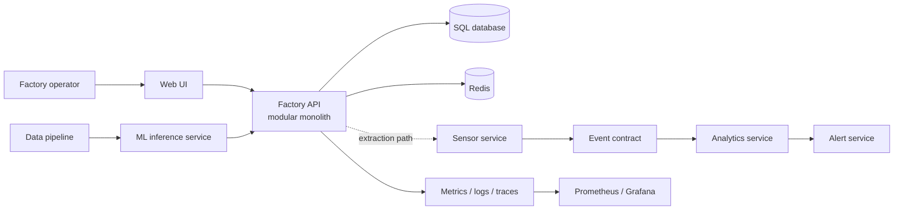

# Factory AI Cloud Native Platform

Cloud-native factory AI platform with microservices, Kubernetes, CI/CD,
observability, SRE, and MLOps.

This is a portfolio-grade learning project that evolves one factory-monitoring
product through a controlled delivery path: a tested modular monolith first,
then containers, services, Kubernetes, observability, SRE practices, and ML
operations.

## Project status

**Day 1 baseline — architecture and delivery plan.** The repository is ready
for implementation, but the runtime services have intentionally not been
claimed as complete yet. The first implementation milestone is tracked in the
GitHub Issues.

## What this project demonstrates

- Python HTTP/REST API design and SQL-backed domain modelling
- Modular-monolith boundaries that can become independently deployable services
- Unit, integration, and API testing as a quality baseline
- Docker, CI/CD, Redis, Kubernetes, Helm, and GitOps delivery
- Prometheus/Grafana observability, SLI/SLO definition, and alert runbooks
- Data-pipeline validation, ML inference, model versioning, and MLOps

## Architecture evolution



The initial system is deliberately a modular monolith. The service boxes are
future extraction boundaries, not a claim that those services already run.
See [`docs/architecture.md`](docs/architecture.md) and
[`docs/adr/0001-modular-monolith-first.md`](docs/adr/0001-modular-monolith-first.md).

## Repository layout

```text
factory-ai-cloud-native-platform/
├── apps/
│   ├── web/                 # Operator-facing UI (planned)
│   └── api/                 # First modular-monolith API
├── services/                # Future independently deployable services
│   ├── sensor-service/
│   ├── analytics-service/
│   ├── alert-service/
│   └── ml-service/
├── data/pipeline/           # Ingestion, validation, and feature flow
├── infrastructure/          # Docker, Kubernetes, Helm, and Argo CD
├── observability/           # Prometheus, Grafana, and alert rules
├── tests/                   # Cross-component test strategy and fixtures
├── docs/                    # Architecture, roadmap, SLI/SLO, and ADRs
└── .github/workflows/       # CI/CD workflows
```

## Learning roadmap

The complete 30-day / 120-hour plan is in
[`docs/learning-roadmap.md`](docs/learning-roadmap.md). Work is integrated on
`develop`; implementation branches use names such as
`feat/monolith-api`, `feat/testing`, and `feat/kubernetes`.

## Quality and operations baseline

Every milestone should leave behind executable evidence: tests, a reproducible
local command, deployment manifests where relevant, and documentation of
known limitations. The initial SLI/SLO proposal is recorded in
[`docs/sli-slo.md`](docs/sli-slo.md).

No production-readiness, measured SLO attainment, model accuracy, or cloud
deployment is implied until it is implemented and verified in this repository.

## Branch model

```text
main        released or reviewed milestones
└── develop integration branch
    └── feat/* short-lived implementation branches
```

## Local development

The Day 1 commit contains the project contract and directory skeleton. Runtime
setup will be added with the first API milestone; follow the Issues for the
current executable entry point rather than assuming a service is available.

## License

License selection is intentionally left for the project owner to confirm before
adding a license file.
